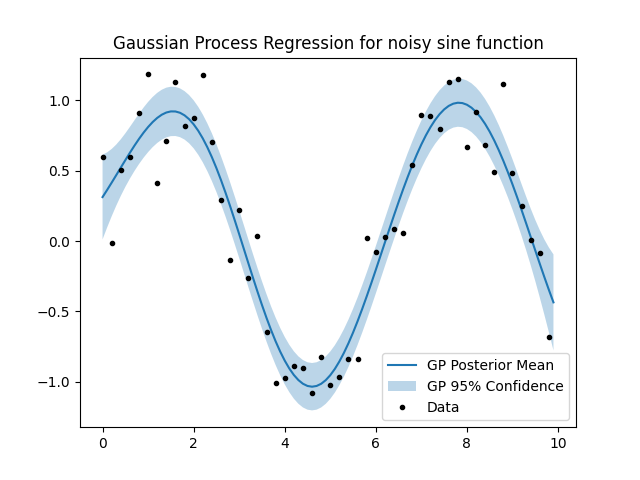

# Shrew
Static C++ library with python bindings for random variable arithmetic. 

Currently featured:

- Arithmetic of normal random variables (e.g. X * Y - Z)
- Probability density and cumulative density of arithmetic expressions with lazy numerical evaluation if no exact solution exists
- Conditionals and marginals of multivariate normal random vectors
- Gaussian process model with hyperparameter optimization

## Installation
### Python
```bash
pip install pyshrew
```

### C++ (CMake)
Install the required dependencies first:

#### Ubuntu/Debian
```bash
sudo apt-get -y install libboost-dev libeigen3-dev libnlopt-cxx-dev
```
#### macOS
```bash
brew install eigen boost nlopt
```

Then build and install:
```console
cd <PathToRepo>/shrew
cmake -S . -B build -DSHREW_PYTHON=OFF -DSHREW_TESTS=OFF
cmake --build build
cmake --install build
```
The library installs to the `install` directory. Use `find_package(shrew)` in your `CMakeLists.txt` (you may need to add the install path to `CMAKE_PREFIX_PATH`), then link with `Shrew::shrew`.

## Development

Install system dependencies (see [C++ section](#c-cmake) above), then either:

**Editable install** — reinstall after C++ changes:
```bash
pip install --no-build-isolation -e .
python -c "import pyshrew; print(dir(pyshrew))"
```

## Python Examples

### Random variable arithmetic
```python
import pyshrew as ps

rv1 = ps.RandomVariable(ps.NormalDistribution(mean=-1.0, stddev=1.0))
rv2 = ps.RandomVariable(ps.NormalDistribution(mean=1.0, stddev=1.0))

# Cumulative distribution of compound random variable at 0.0
print((rv1 * rv2).pdist.cdf(0.0))

# Probability density distribution of compound random variable at 2.0
print((0.5 / rv1).pdist.cdf(2.0))
```

### Random vector operations
```python
import pyshrew as ps
import numpy as np

mu = np.array([1, 2])  # Mean
K = np.array([[4, 1.5], [1.5, 1]])  # Covariance matrix

rvec = ps.RandomVector(mu, K)

# Define conditional indices, condition type, and condition values
# below, we define the 0th index to be equal (=) to 3
indices = [0]
condition = '='
values = np.array([3])

# Get conditional random vector
conditional_rvec = ps.get_conditional(rvec, indices, condition, values)

print(f'Conditional mean: {conditional_rvec.mu}')
print(f'Conditional variance: {conditional_rvec.K}')
```

### Gaussian Process optimization
```python
import pyshrew as ps
import numpy as np
import matplotlib.pyplot as plt

# Generate synthetic data
n_data, n_eval = 50, 100
range_x = 10
noise = 0.2

x_eval = np.array([x * range_x / n_eval for x in range(0, n_eval)])
x_data = np.array([x * range_x / n_data for x in range(0, n_data)])
x = np.append(x_eval, x_data)
y = np.array([np.sin(xi) + np.random.normal(0, noise) for xi in x_data])
conditional_indices = [x for x in range(n_eval, n_eval+n_data)]

# Define hyperparameter initial values and their lower and upper bounds
hyperparameters_iv = ps.SEHyperparams(signal_stdv=0.5, lengthscale=0.5, noise_stdv=0.3)
hyperparameters_lb = ps.SEHyperparams(signal_stdv=0, lengthscale=0, noise_stdv=0)
hyperparameters_ub = ps.SEHyperparams(signal_stdv=100, lengthscale=100, noise_stdv=100)

kernel = ps.SquaredExponential(
    hyperparameters_iv, hyperparameters_lb, hyperparameters_ub, 
    conditional_indices)

# Create Gaussian process and optimize hyperparameters
gp = ps.GaussianProcess(x, y, conditional_indices, kernel)
print("Initial log marginal likelihood:", gp.log_marginal_likelihood())
gp.optimize()

# Get posterior distribution
mu, stdv = gp.get_posterior()

# Plot predictions
ylow = [zp[0]-1.96*zp[1] for zp in zip(mu, stdv)]
yhi = [zp[0]+1.96*zp[1] for zp in zip(mu, stdv)]

plt.plot(x_eval, mu, label=r'GP Posterior Mean')
plt.fill_between(x_eval, ylow, yhi, alpha=0.3, label=r'GP 95% Confidence')
plt.plot(x_data, y, 'k.', label='Data')
plt.legend()
plt.title('Gaussian Process Regression for noisy sine function')
plt.show()
```

