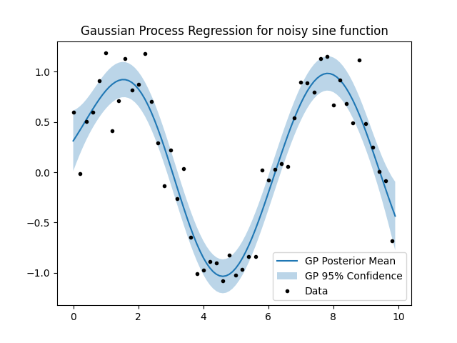

# Shrew
Static C++ library with python bindings for random variable arithmetic. 

Currently featured:

- Arithmetic of normal random variables (e.g. X * Y - Z)
- Probability density and cumulative density of arithmetic expressions with lazy numerical evaluation if no exact solution exists
- Conditionals and marginals of multivariate normal random vectors
- Gaussian process model with hyperparameter optimization

## Requirements
Shrew requires the `Eigen C++`, `Boost.Math`, `NLopt`, and `pybind11` libraries. If these dependencies are not installed in the default paths, set the environment variable `SHREW_DEPS` to the root directory where they are located.

## Installation
### CMake
After cloning the remote repository, open the terminal and set the working directory to the local repository
```console
cd <PathToRepo>/shrew
mkdir build
cd build
cmake ..
cmake --build .
cmake --install .
```
The installed library should now be in the `install` directory inside the repository. 
To use it in other projects, import it using the `find_package(shrew)` command in your `CMakeLists.txt`. You may have to append the install directory to your `CMAKE_PREFIX_PATH` variable. Finally, add the library to your target using `target_link_libraries` with the shrew library target name `Shrew::shrew`.

### Shrew python package
There are python bindings for the shrew package. Currently only support for binary arithmetic operations of random variables and vectors of normal distributions and operations of normal random variables with constants. 

To install it, you can use `pip install <shrew path>/install/pyshrew` after running the cmake installation described above. Ensure the `PYTHON_EXECUTABLE` is set to the same python instance as the pip command by running
```bash
cmake .. -DPYTHON_EXECUTABLE=<path-to-your-python-executable>
```

## Python Examples

### Random variable arithmetic
```python
import pyshrew as ps

rv1 = ps.RandomVariable(ps.NormalDistribution(mean=-1.0, stddev=1.0))
rv2 = ps.RandomVariable(ps.NormalDistribution(mean=1.0, stddev=1.0))

# Cumulative distribution of compound random variable at 0.0
print((rv1 * rv2).pdist.cdf(0.0))

# Probability density distribution of compound random variable at 2.0
print((0.5 / rv1).pdist.cdf(2.0))
```

### Random vector operations
```python
import pyshrew as ps
import numpy as np

mu = np.array([1, 2])  # Mean
K = np.array([[4, 1.5], [1.5, 1]])  # Covariance matrix

rvec = ps.RandomVector(mu, K)

# Define conditional indices, condition type, and condition values
# below, we define the 0th index to be equal (=) to 3
indices = [0]
condition = '='
values = np.array([3])

# Get conditional random vector
conditional_rvec = ps.get_conditional(rvec, indices, condition, values)

print(f'Conditional mean: {conditional_rvec.mu}')
print(f'Conditional variance: {conditional_rvec.K}')
```

### Gaussian Process optimization
```python
import pyshrew as ps
import numpy as np
import matplotlib.pyplot as plt

# Generate synthetic data
n_data, n_eval = 50, 100
range_x = 10
noise = 0.2

x_eval = np.array([x * range_x / n_eval for x in range(0, n_eval)])
x_data = np.array([x * range_x / n_data for x in range(0, n_data)])
x = np.append(x_eval, x_data)
y = np.array([np.sin(xi) + np.random.normal(0, noise) for xi in x_data])
conditional_indices = [x for x in range(n_eval, n_eval+n_data)]

# Initial hyperparameters: sigma_f, l, sigma_n1
hp_ic = [0.5, 0.3, 0.5]

# Lower and upper bounds for hyperparameters
hp_lower_bounds = [0, 0, 0]
hp_upper_bounds = [100, 100, 100]

# Define kernel
kernel = ps.SquaredExponential(
    hp_ic, hp_lower_bounds, hp_upper_bounds, 
    conditional_indices)

# Create Gaussian process and optimize hyperparameters
gp = ps.GaussianProcess(x, y, conditional_indices, kernel)
print("Initial log marginal likelihood:", gp.log_marginal_likelihood())
gp.optimize()

# Get posterior distribution
mu, stdv = gp.get_posterior()

# Plot predictions
ylow = [zp[0]-1.96*zp[1] for zp in zip(mu, stdv)]
yhi = [zp[0]+1.96*zp[1] for zp in zip(mu, stdv)]

plt.plot(x_eval, mu, label=r'GP Posterior Mean')
plt.fill_between(x_eval, ylow, yhi, alpha=0.3, label=r'GP 95% Confidence')
plt.plot(x_data, y, 'k.', label='Data')
plt.legend()
plt.title('Gaussian Process Regression for noisy sine function')
plt.show()
```
